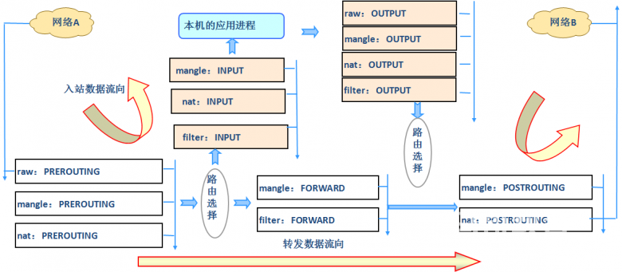

## 简介
Linux防火墙是由Netfilter组件提供的，Netfilter工作在内核空间，集成在linux内核中；  
iptables提供命令行工具，工作在用户空间，用来编写规则，写好的规则被送往netfilter，告诉内核如何去处理信息包；  

## 组成
iptables由五个表table和五个链chain以及一些规则组成  

五个表table：filter、nat、mangle、raw、security

filter表：过滤规则表，根据预定义的规则过滤符合条件的数据包  
nat表：network address translation 地址转换规则表  
mangle：修改数据标记位规则表  
raw：关闭启用的连接跟踪机制，加快封包穿越防火墙速度  
security：用于强制访问控制（MAC）网络规则，由Linux安全模块（如SELinux）实现  

优先级由高到低的顺序为：

security -->raw-->mangle-->nat-->filter

## 流程图
